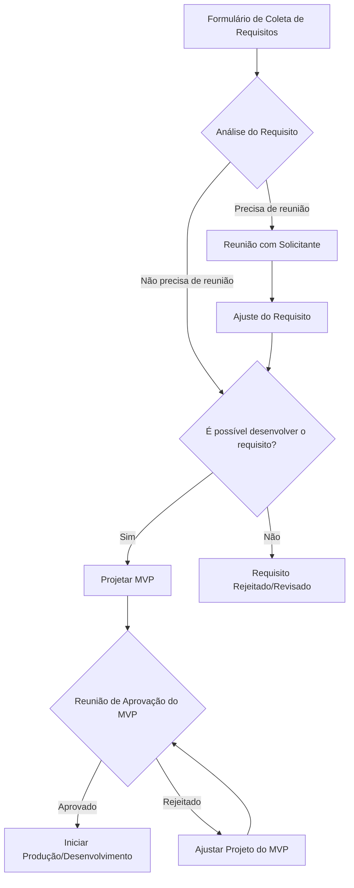

---
Fluxo para Coleta de Requisitos
---

```mermaid
    graph TD
        A[Formulário de Coleta de Requisitos] --> B{Análise do Requisito};
        B -->|Não precisa de reunião| C{É possível desenvolver o requisito?};
        B -->|Precisa de reunião| D[Reunião com Solicitante];
        D --> E[Ajuste do Requisito];
        E --> C;
        C -->|Sim| F[Projetar MVP];
        C -->|Não| G[Requisito Rejeitado/Revisado];
        F --> H{Reunião de Aprovação do MVP};
        H -->|Aprovado| I[Iniciar Produção/Desenvolvimento];
        H -->|Rejeitado| J[Ajustar Projeto do MVP];
        J --> H;
```