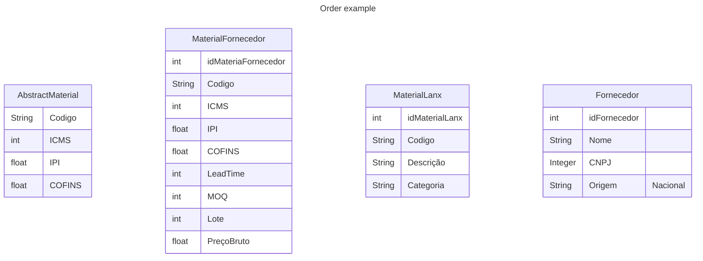

```mermaid
---
title: Order example
---

erDiagram

    AbstractMaterial{
        String Codigo
        int ICMS
        float IPI
        float COFINS
    }

    MaterialFornecedor{
        int idMateriaFornecedor
        String Codigo
        int ICMS
        float IPI
        float COFINS
        int LeadTime
        int MOQ
        int Lote
        float PreçoBruto
    }

    MaterialLanx{
        int idMaterialLanx
        String Codigo
        String Descrição
        String Categoria
    }

    Fornecedor {
        int idFornecedor        
        String Nome
        Integer CNPJ
        String Origem "Nacional"
    }


```